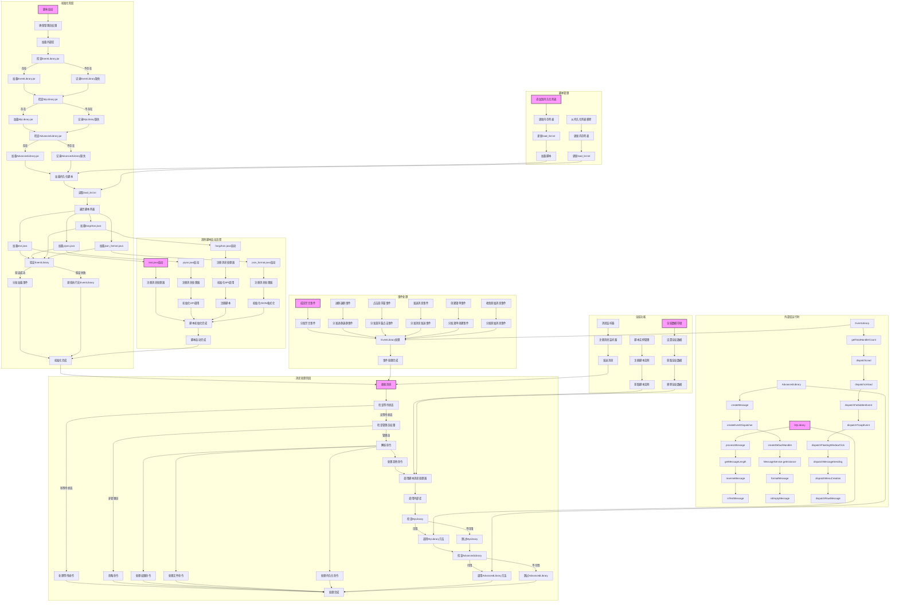

# QStory 热加载脚本框架

一个基于QStory平台的Java脚本框架，提供热加载、全局方法机制、模块化设计等功能，解决脚本冲突问题。

## 功能特性

- **热加载Java代码**：支持动态加载、编辑和保存Java文件
- **持久化加载列表**：通过`load_list.txt`文件管理持久化脚本，自动加载
- **动态管理员白名单**：支持添加/移除管理员权限
- **全局方法机制**：通过main.java提供的全局方法，实现脚本间的协作，避免方法冲突
- **外部库集成**：支持加载外部JAR文件，扩展脚本功能
- **错误隔离**：一个处理器的错误不会影响其他处理器的运行
- **脚本加载优化**：脚本加载优先于外部库验证，确保脚本正常加载
- **简单易用**：使用简单的方法调用，不需要复杂的接口实现
- **直接集成**：不需要依赖外部库，直接使用main.java提供的方法

## 系统架构

### 流程原理图



### 脚本加载流程

1. **初始化阶段**：
   - 脚本启动时首先确保当前用户为管理员
   - 按顺序加载外部库（EventLibrary、MyLibrary、AdvancedLibrary）
   - 读取`load_list.txt`文件，获取需要持久化加载的脚本列表
   - 按顺序加载列表中的脚本：text.java、yiyan.java、fangzhan.java、json_format.java
   - 验证EventLibrary是否加载成功
   - 分发加载事件（如果EventLibrary可用）

2. **脚本启动流程**：
   - **text.java**：启动 → 注册消息处理器 → 初始化完成
   - **yiyan.java**：启动 → 注册消息处理器 → 初始化API调用 → 初始化完成
   - **fangzhan.java**：启动 → 注册消息处理器 → 初始化API调用 → 注册脚本 → 初始化完成
   - **json_format.java**：启动 → 注册消息处理器 → 初始化JSON格式化 → 初始化完成

3. **运行时流程**：
   - 接收消息后检查等待状态
   - 检查管理员权限
   - 解析并处理命令
   - 调用注册的脚本消息处理器
   - 根据需要调用外部库功能

4. **脚本管理**：
   - 使用`/保持`命令将脚本添加到持久化列表
   - 使用`/取消保持`命令从持久化列表移除脚本
   - 持久化列表会同步到`load_list.txt`文件

## 脚本加载说明

### 1. 持久化脚本列表

- **文件位置**：`scripts/load_list.txt`
- **格式**：每行一个脚本文件名（如 `text.java`）
- **自动加载**：主脚本启动时会自动加载列表中的所有脚本
- **手动管理**：使用以下命令管理持久化列表：
  - `/保持 文件名.java` - 将脚本加入持久化列表并加载
  - `/取消保持 文件名.java` - 从持久化列表移除
  - `/列表` - 查看当前持久化列表

### 2. 脚本启动顺序

1. **外部库加载**：EventLibrary → MyLibrary → AdvancedLibrary
2. **持久化脚本加载**：按`load_list.txt`文件中的顺序加载
3. **自动加载**：加载scripts目录中其他未在列表中的Java文件

### 3. 脚本初始化流程

每个脚本在加载时会执行以下操作：
1. 创建消息处理器实例
2. 注册到main.java的消息处理器列表
3. 执行必要的初始化操作（如API调用初始化、功能初始化等）
4. 注册脚本实例（可选）
5. 输出初始化完成日志

### 4. 脚本协作机制

脚本之间通过main.java提供的全局方法进行协作：
- **消息传递**：通过消息监听器机制传递消息
- **数据共享**：通过全局数据存储共享数据
- **实例访问**：通过脚本实例管理访问其他脚本实例

### 5. 错误处理

- **脚本加载错误**：单个脚本加载失败不会影响其他脚本的加载
- **运行时错误**：单个脚本的运行时错误不会影响其他脚本的执行
- **外部库错误**：外部库缺失或加载失败时，系统会降级运行，仅影响依赖该库的功能

## 目录结构

```
├── main.java          # 主脚本文件
├── text.java          # 示例脚本文件
├── scripts/           # 脚本目录
│   └── text.java      # scripts目录中的示例脚本
├── EventLibrary.java  # 事件分发库源文件
├── MyLibrary.java     # 基础工具库
├── AdvancedLibrary.java # 高级功能库
├── EventLibrary.jar   # 编译后的事件分发库
├── MyLibrary.jar      # 编译后的基础工具库
├── AdvancedLibrary.jar # 编译后的高级功能库
├── API.md             # QStory API文档
├── DEVELOPMENT.md     # 开发文档
├── README.md          # 项目说明文档
├── desc.txt           # 脚本描述文件
├── info.prop          # 脚本信息文件
└── debug.log          # 调试日志文件
```

## 快速开始

### 1. 安装

1. 克隆本仓库到本地：
   ```bash
   git clone https://github.com/zhch223/qstory-script.git
   ```

2. 将文件夹复制到QStory脚本目录中

3. 在QStory中加载 `main.java`

### 2. 持久化脚本列表

- **位置**：`scripts/load_list.txt`
- **格式**：每行一个脚本文件名（如 `text.java`）
- **自动加载**：主脚本启动时会自动加载列表中的脚本
- **手动管理**：使用 `/保持` 和 `/取消保持` 命令管理列表

### 3. 基本命令

**管理员命令**：
- `/加权 QQ号` - 将指定QQ加入管理员白名单
- `/去权 QQ号` - 将指定QQ从管理员白名单移除
- `/保存 文件名.java` - 静默等待下一条消息作为代码保存
- `/编辑 文件名.java` - 显示当前内容，等待新内容覆盖
- `/加载 文件名.java` - 立即加载脚本
- `/保持 文件名.java` - 加入持久化列表并加载
- `/取消保持 文件名.java` - 从持久化列表移除
- `/取消` - 放弃当前等待状态
- `/列表` - 查看持久化加载列表
- `/脚本列表` - 查看所有脚本文件
- `/stop 文件名.java` - 停止指定脚本

### 3. 创建消息处理器

```java
// text.java示例

// 文本消息处理器类
class TextMessageHandler {
    public void onMessage(Object msg) {
        try {
            log("Text handler received message: " + (msg.MessageContent != null ? msg.MessageContent : "null"));    

            // 检查消息内容是否为"text"
            if (msg.MessageContent != null && msg.MessageContent.trim().equals("text")) {
                log("Text handler processing text message");
                // 群聊时发到群，私聊时发回给个人
                if (msg.IsGroup) {
                    sendMsg(msg.GroupUin, "", "hello world from text");
                } else {
                    sendMsg("", msg.UserUin, "hello world from text");
                }
            }
        } catch (Exception e) {
            error(e);
            log("Error in text handler: " + e.getMessage());
        }
    }
}

// 创建处理器实例
TextMessageHandler textHandler = new TextMessageHandler();

// 注册到main.java的消息处理器列表
registerScriptMessageHandler(textHandler);

// 注册脚本
registerScript("text", textHandler);

log("text.java loaded successfully - using global methods");

// 测试全局方法
logGlobal("Text script initialized");
```

## 全局方法

main.java提供以下全局方法，其他脚本应使用这些方法进行交互：

1. **registerScriptMessageHandler(Object handler)** - 注册消息处理器
2. **registerMessageHandler(String name, Object handler)** - 注册命名的消息处理器
3. **registerScript(String scriptName, Object scriptObject)** - 注册脚本
4. **sendGlobalMessage(String groupUin, String userUin, String content)** - 发送消息
5. **logGlobal(String message)** - 记录日志
6. **errorGlobal(Exception e)** - 处理错误
7. **isGlobalAdmin(String qq)** - 检查是否为管理员
8. **setGlobalData(String key, Object value)** - 存储全局数据
9. **getGlobalData(String key)** - 获取全局数据
10. **removeGlobalData(String key)** - 删除全局数据
11. **registerMessageListener(String messageType, Object listener)** - 注册消息监听器
12. **sendMessage(String messageType, Object data)** - 发送消息
13. **registerScriptInstance(String scriptName, Object instance)** - 注册脚本实例
14. **getScriptInstance(String scriptName)** - 获取脚本实例

**重要提醒**：其他脚本应通过上述全局方法进行交互，**不可直接使用API.MD中提供的全局方法**（如onMsg、onLoad等），否则会与主脚本产生方法冲突，导致脚本无法正常运行。

## 开发指南

### 1. 创建新脚本

1. 使用 `/保存 文件名.java` 命令创建新脚本
2. 编写脚本代码，注册必要的事件处理器
3. 使用 `/加载 文件名.java` 命令加载脚本
4. 可选：使用 `/保持 文件名.java` 命令将脚本加入持久化列表

### 2. 消息处理器最佳实践

- **模块化设计**：将不同功能拆分为多个小脚本
- **错误处理**：在处理器中添加异常处理，避免影响其他处理器
- **日志记录**：使用 `log()` 方法记录关键操作
- **简单实现**：创建包含onMessage方法的处理器类
- **正确注册**：使用registerScriptMessageHandler方法注册处理器

### 3. 外部库使用

```java
// 测试基础库
String processed = MyLibrary.processMessage(content);
int length = MyLibrary.getMessageLength(content);
String reversed = MyLibrary.reverseMessage(content);
boolean isTest = MyLibrary.isTestMessage(content);

// 测试高级库
Object messageObj = AdvancedLibrary.createMessage(content, msg.UserUin);
String formattedMsg = AdvancedLibrary.formatMessage(messageObj);
boolean isEmpty = AdvancedLibrary.isEmptyMessage(messageObj);
```

## 示例脚本

### 消息响应脚本

```java
// text.java

// 文本消息处理器类
class TextMessageHandler {
    public void onMessage(Object msg) {
        try {
            log("Text handler received message: " + (msg.MessageContent != null ? msg.MessageContent : "null"));    

            // 检查消息内容是否为"text"
            if (msg.MessageContent != null && msg.MessageContent.trim().equals("text")) {
                log("Text handler processing text message");
                // 群聊时发到群，私聊时发回给个人
                if (msg.IsGroup) {
                    sendMsg(msg.GroupUin, "", "hello world from text");
                } else {
                    sendMsg("", msg.UserUin, "hello world from text");
                }
            }
        } catch (Exception e) {
            error(e);
            log("Error in text handler: " + e.getMessage());
        }
    }
}

// 创建处理器实例
TextMessageHandler textHandler = new TextMessageHandler();

// 注册到main.java的消息处理器列表
registerScriptMessageHandler(textHandler);

// 注册脚本
registerScript("text", textHandler);

log("text.java loaded successfully - using global methods");

// 测试全局方法
logGlobal("Text script initialized");
```

## 常见问题

### 1. 脚本加载失败

- **检查语法**：确保脚本语法符合QStory要求，无注解、无修饰符
- **检查依赖**：确保所有依赖的外部库已正确加载
- **查看日志**：查看debug.log文件，了解具体错误信息

### 2. 消息处理器不生效

- **检查注册**：确保处理器已正确注册到main.java
- **检查逻辑**：确保处理器的onMessage方法逻辑正确
- **查看日志**：查看debug.log文件，了解处理器注册和执行情况

### 3. 主脚本无响应

- **检查冲突**：确保没有其他脚本覆盖了回调方法
- **检查日志**：查看debug.log文件，了解主脚本执行情况
- **检查权限**：确保发送命令的用户有管理员权限

## 技术栈

- **开发语言**：Java
- **运行环境**：QStory脚本环境（JDK 9）
- **核心功能**：全局方法机制（脚本协作）
- **工具库**：MyLibrary、AdvancedLibrary
- **可选库**：EventLibrary（事件分发）

## 贡献

欢迎提交Issue和Pull Request，帮助改进这个项目！

## 许可证

MIT License

## 更新日志

- **2026-02-23**：重构代码架构，使用全局方法机制替代事件分发机制，提高稳定性和易用性
- **2026-02-21**：初始版本，实现基础的热加载和事件分发功能

---

**作者**：氢氧根
**项目地址**：https://github.com/zhch223/qstory-script
**文档**：DEVELOPMENT.md（详细开发文档）
